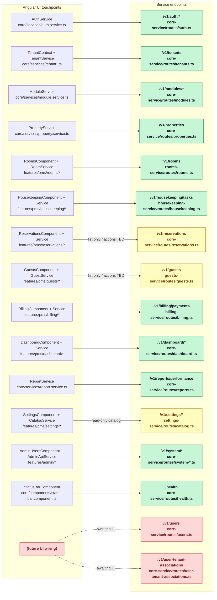

# UI ↔ API Wiring Map

This note captures how the Angular UI talks to the Fastify/Node APIs today. It highlights three states:

- **Wired** – the UI already calls the API and renders the data.
- **Partially wired** – the UI reads data but mutation/advanced flows are stubbed.
- **Not yet wired** – the API exists but no UI code references it.

## Mermaid overview

## Status details

| Domain / Endpoint | Status | UI touchpoint(s) | Evidence |
| --- | --- | --- | --- |
| Auth (`/v1/auth/*`) | Wired | `AuthService` (`src/app/core/services/auth.service.ts`) handles `/auth/login` and `/auth/change-password`. | UI methods call the endpoints directly; Fastify route defined in `Apps/core-service/src/routes/auth.ts`. |
| Tenants (`/v1/tenants`) | Wired | `TenantService` + `TenantContextService` fetch and cache tenants (`src/app/core/services/tenant*.ts`). | Fastify route `Apps/core-service/src/routes/tenants.ts`. |
| Modules (`/v1/modules/catalog`, `/tenants/:id/modules`) | Wired | `ModuleService` (`src/app/core/services/module.service.ts`). | API routes `Apps/core-service/src/routes/modules.ts` and `routes/tenants.ts`. |
| Properties (`/v1/properties`) | Wired | `PropertyService` + PMS layout property selector (`src/app/core/services/property.service.ts`, `features/pms/pms-layout.component.ts`). | API route `Apps/core-service/src/routes/properties.ts`. |
| Rooms (`/v1/rooms`) | Wired | `RoomsComponent` + `RoomService` (`features/pms/rooms/*`, `core/services/room.service.ts`). | Route `Apps/rooms-service/src/routes/rooms.ts`. |
| Housekeeping (`/v1/housekeeping/tasks`) | Wired | `HousekeepingComponent` + `HousekeepingService` (`features/pms/housekeeping/*`). | Route `Apps/housekeeping-service/src/routes/housekeeping.ts`. |
| Reservations (`/v1/reservations`) | **Partially wired** | `ReservationService` feeds the grid, but `viewReservation`, `editReservation`, `cancelReservation` in `features/pms/reservations/reservations.component.ts:207-216` only log to console. | API list endpoint exists in `Apps/core-service/src/routes/reservations.ts`; mutation flows still TODO on UI. |
| Guests (`/v1/guests`) | **Partially wired** | `GuestService` loads data, yet `viewGuest` / `messageGuest` in `features/pms/guests/guests.component.ts:153-166` are placeholders. | API list endpoint: `Apps/guests-service/src/routes/guests.ts`. |
| Billing (`/v1/billing/payments`) | Wired | `BillingComponent` + `BillingService` (`features/pms/billing/*`, `core/services/billing.service.ts`). | Route file `Apps/billing-service/src/routes/billing.ts`. |
| Dashboard (`/v1/dashboard/*`) | Wired | `DashboardService` powering `DashboardComponent` (`features/pms/dashboard/dashboard.component.ts`). | API routes `Apps/core-service/src/routes/dashboard.ts`. |
| Reports (`/v1/reports/performance`) | Wired | `ReportService` (`src/app/core/services/report.service.ts`). | Route `Apps/core-service/src/routes/reports.ts`. |
| Settings catalog (`/v1/settings/*`) | **Partially wired** | `SettingsComponent` renders catalog/value data, but `updateTenantProfile` in `features/pms/settings/settings.component.ts:166-168` is a stub. | API served by `Apps/settings-service/src/routes/catalog.ts`. |
| Platform admin (`/v1/system/*`) | Wired | `AdminUsersComponent` + `AdminApiService` (`src/app/core/services/admin-api.service.ts`, `features/admin/admin-users.component.ts`). | Routes under `Apps/core-service/src/routes/system-*.ts`. |
| Health (`/health`) | Wired | `StatusBarComponent` polls health endpoint (`src/app/core/components/status-bar.component.ts:218-329`). | Route `Apps/core-service/src/routes/health.ts`. |
| Users (`/v1/users`) | **Not wired** | No references to `/v1/users` under `Apps/tartware-ui/src` (`rg -n "/v1/users" Apps/tartware-ui/src` returns nothing). | API route exists in `Apps/core-service/src/routes/users.ts`. |
| User ↔ Tenant associations (`/v1/user-tenant-associations`) | **Not wired** | No UI service hits this endpoint (`rg -n "user-tenant-associations" Apps/tartware-ui/src` yields no matches). | Route lives in `Apps/core-service/src/routes/user-tenant-associations.ts`. |

### How to extend

- When wiring a new UI flow, add the service/component path to the table above so auditors can trace it quickly.
- Consider exporting this Mermaid diagram in release notes whenever a module crosses from “backlog” to “wired.”
- If you add new API routes under `Apps/core-service/src/routes`, run `rg "/v1/"` in `Apps/tartware-ui/src` to verify the UI actually references them before calling the wiring complete.
