# Tartware PMS

A **command-driven Property Management System** built as a TypeScript monorepo targeting **20K ops/sec**. All write traffic flows through a central Command Center into Kafka; domain services consume commands asynchronously. Read traffic is proxied via the API Gateway directly to backend services.

---

## Table of Contents

- [Architecture Overview](#architecture-overview)
- [Overall Application Flow](#overall-application-flow)
- [Service Directory](#service-directory)
  - [1. API Gateway](#1-api-gateway-port-8080)
  - [2. Core Service](#2-core-service-port-3000)
  - [3. Rooms Service](#3-rooms-service-port-3015)
  - [4. Guests Service](#4-guests-service-port-3010)
  - [5. Reservations Command Service](#5-reservations-command-service-port-3020)
  - [6. Billing Service](#6-billing-service-port-3025)
  - [7. Housekeeping Service](#7-housekeeping-service-port-3030)
  - [8. Availability Guard Service](#8-availability-guard-service-port-3045--grpc-4400)
  - [9. Notification Service](#9-notification-service-port-3055)
  - [10. Revenue Service](#10-revenue-service-port-3060)
- [Shared Libraries](#shared-libraries)
- [Industry Standards](#industry-standards)
- [Best Practices](#best-practices)
- [Quick Start](#quick-start)
- [Dev Ports](#dev-ports)

---

## Architecture Overview

```
┌─────────────────────────────────────────────────────────────────────┐
│                        CLIENT (UI / API)                            │
└──────────────────────────────┬──────────────────────────────────────┘
                               │
                               ▼
┌─────────────────────────────────────────────────────────────────────┐
│                     API GATEWAY (:8080)                              │
│  JWT Auth → Rate Limiting → Circuit Breaker → Route                 │
│    ┌─────────────┐    ┌──────────────────┐                          │
│    │ GET requests │    │ POST/PUT/DELETE  │                          │
│    │ → HTTP Proxy │    │ → Kafka Command  │                          │
│    └──────┬──────┘    └────────┬─────────┘                          │
└───────────┼────────────────────┼────────────────────────────────────┘
            │                    │
    ┌───────▼───────┐    ┌──────▼──────────────┐
    │ Backend       │    │ commands.primary     │
    │ Services      │    │ (Kafka, 12 parts)    │
    │ (HTTP GET)    │    └──────┬───────────────┘
    └───────────────┘           │
                    ┌───────────┼───────────────────────┐
                    ▼           ▼                       ▼
             Domain Services consume commands asynchronously
```

---

## Overall Application Flow

This diagram shows how a request moves through the entire Tartware ecosystem — from client to data store and back.

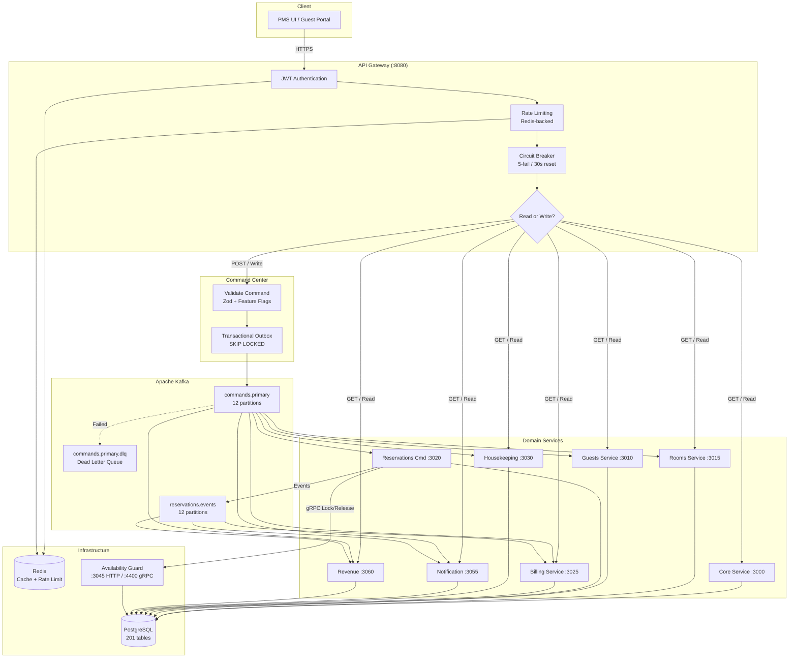

---

## Service Directory

### 1. API Gateway (Port 8080)

**Role:** Single entry point for all client traffic. Performs **zero domain logic** — it either proxies read requests to backend services or dispatches write requests as Kafka commands.

**Where it stands:** The gateway is the outermost boundary of the system. Every request — whether from the PMS UI, guest portal, or external API consumer — must pass through the gateway. It enforces authentication, rate limiting, and circuit breaking before any request reaches a domain service.

#### How It Processes a Request

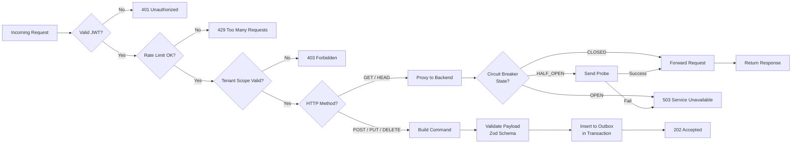

#### Key Features

| Feature | Details |
|---------|---------|
| **Authentication** | RS256 JWT verification, role hierarchy (OWNER > ADMIN > MANAGER > STAFF > VIEWER) |
| **Rate Limiting** | Redis-backed with in-memory fallback. 200 req/min default, 60 req/min writes, 20 req/min auth |
| **Circuit Breaker** | Per-service state machine: 5-failure threshold, 30s reset timeout, half-open probing |
| **Proxy** | 30s timeout, retry on GET/HEAD (2 retries, 250ms exponential backoff with jitter) |
| **Command Dispatch** | Zod validation → transactional outbox → Kafka `commands.primary` topic |

#### Proxy Targets

| Target Service | Proxied Routes |
|---------------|---------------|
| core-service (:3000) | Tenants, properties, auth, users, dashboard, modules, settings, reports, operations, compliance, night-audit, registry |
| guests-service (:3010) | Guest CRUD, loyalty, self-service, GDPR |
| rooms-service (:3015) | Rooms, room-types, buildings, rates, rate-calendar, availability, recommendations |
| reservations-cmd (:3020) | Reservation lifecycle |
| billing-service (:3025) | Payments, charges, folios, invoices, AR, calculations, tax config |
| housekeeping (:3030) | Tasks, incidents, maintenance |
| notification (:3055) | Templates, send, history, rules |
| revenue (:3060) | Pricing rules, yield management, KPIs |

---

### 2. Core Service (Port 3000)

**Role:** The administrative backbone of the PMS. Manages tenants, users, properties, authentication, settings, reporting, and operational config. This is the largest service with **100+ REST endpoints**.

**Where it stands:** Core Service is the foundational layer that every other service depends on for tenant resolution, user authentication, and configuration data. It's the first service that must be running for the system to function.

#### How It Processes a Request

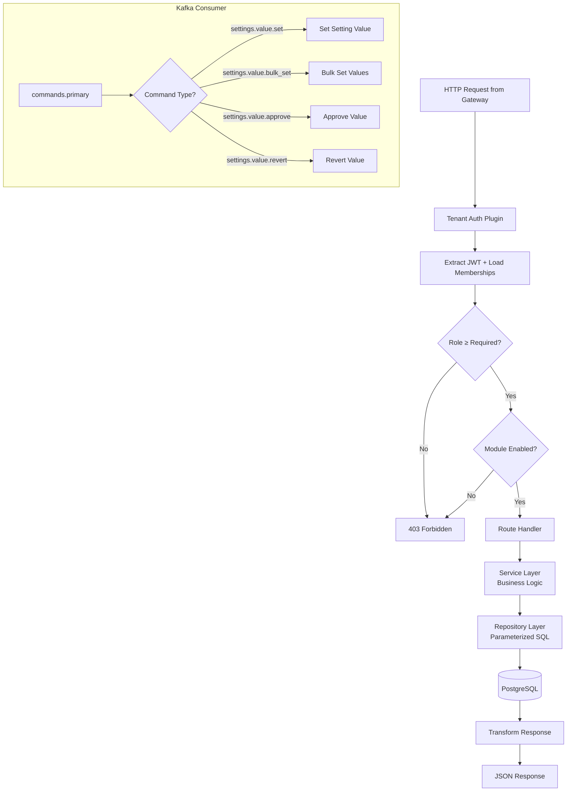

#### Key Domains

| Domain | Endpoints | Description |
|--------|-----------|-------------|
| **Auth** | 7 | Login, JWT refresh, MFA (TOTP enroll/verify/rotate), password management |
| **System Admin** | 8 | Break-glass access, tenant bootstrap, system user management, impersonation |
| **Tenants & Users** | 8 | Tenant lifecycle, user CRUD, tenant-user associations, role assignment |
| **Properties** | 3 | Multi-property management per tenant |
| **Modules** | 3 | Feature module catalog + per-tenant module activation |
| **Dashboard** | 3 | KPI stats, activity feed, pending tasks |
| **Reports** | 17 | Occupancy, revenue, arrivals/departures, housekeeping, audit trail, flash reports |
| **Operations** | 12 | Cashier sessions, shift handovers, lost & found, BEOs, guest feedback, police reports |
| **Settings** | 20 | Settings catalog, per-tenant values, screen permissions, packages, amenities |
| **Booking Config** | 28 | Allotments, booking sources, market segments, channel mappings, companies, meeting rooms, events, waitlist, group bookings, promo codes, metasearch |
| **Night Audit** | 4 | Audit status, history, business calendar |
| **Compliance** | 4 | GDPR breach incident tracking + notification |
| **Service Registry** | 5 | In-memory service discovery (register, heartbeat, deregister, list) |
| **Direct Booking** | 3 | Availability search, rate quote, booking creation |

#### Kafka Commands

| Command | Description |
|---------|-------------|
| `settings.value.set` | Set a single setting value |
| `settings.value.bulk_set` | Bulk set multiple settings |
| `settings.value.approve` | Approve a pending setting change |
| `settings.value.revert` | Revert a setting to previous value |

---

### 3. Rooms Service (Port 3015)

**Role:** Manages the physical room inventory, room types, buildings, rate plans, availability, and a personalized recommendation engine. This is the inventory master of the PMS.

**Where it stands:** Rooms Service is the single source of truth for physical room data. The reservation system queries it for availability, the billing system references it for rates, and the housekeeping system references it for room status.

#### How It Processes a Request

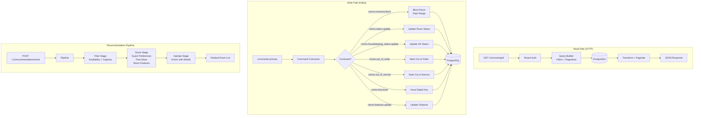

#### REST Endpoints (30+)

| Category | Method | Path | Description |
|----------|--------|------|-------------|
| Rooms | GET | `/v1/rooms`, `/grid` | List / grid view with filtering |
| Rooms | POST | `/v1/rooms` | Create room |
| Rooms | GET/PUT/DELETE | `/v1/rooms/:roomId` | CRUD operations |
| Rooms | POST | `/v1/rooms/:roomId/activate` | Activate room |
| Room Types | GET | `/v1/room-types`, `/grid` | List / grid |
| Room Types | POST/PUT | `/v1/room-types` | Create / update |
| Buildings | GET/POST/PUT | `/v1/buildings` | Building management |
| Rates | GET/POST/PUT/DELETE | `/v1/rates` | Rate plan CRUD |
| Rate Calendar | GET/PUT | `/v1/rate-calendar` | Calendar entries / bulk upsert |
| Rate Calendar | POST | `/v1/rate-calendar/range-fill` | Fill date range |
| Availability | GET | `/v1/availability`, `/calendar`, `/room-types` | Availability queries |
| Recommendations | GET/POST | `/v1/recommendations`, `/rank` | Personalized room ranking |

#### Kafka Commands (10)

| Command | Description |
|---------|-------------|
| `rooms.inventory.block` | Block room inventory for date range |
| `rooms.inventory.release` | Release a manual block |
| `rooms.status.update` | Update room status (available/occupied/maintenance) |
| `rooms.housekeeping_status.update` | Update housekeeping status (clean/dirty/inspected) |
| `rooms.out_of_order` | Mark room out of order |
| `rooms.out_of_service` | Mark room out of service |
| `rooms.move` | Move/renumber a room |
| `rooms.features.update` | Update room features/amenities |
| `rooms.key.issue` | Issue digital/physical key |
| `rooms.key.revoke` | Revoke a key |

---

### 4. Guests Service (Port 3010)

**Role:** Guest profile management, GDPR/CCPA compliance, loyalty engine, and guest self-service flows (mobile check-in, direct booking, reward redemption).

**Where it stands:** Guests Service owns the guest identity. It is referenced by reservations (who is staying), billing (who to charge), and notifications (who to contact). It also powers the guest-facing self-service portal.

#### How It Processes a Request

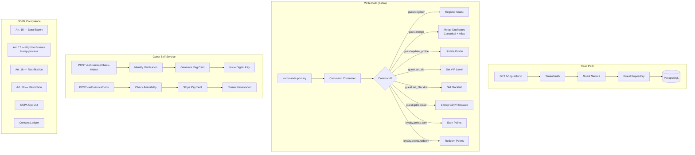

#### Kafka Commands (15)

| Command | Description |
|---------|-------------|
| `guest.register` | Register a new guest profile |
| `guest.merge` | Merge duplicate guest profiles |
| `guest.update_profile` | Update guest profile details |
| `guest.update_contact` | Update contact information |
| `guest.set_loyalty` | Set loyalty tier/number |
| `guest.set_vip` | Set VIP status (1–5 levels) |
| `guest.set_blacklist` | Set blacklist status |
| `guest.gdpr.erase` | GDPR erasure (Art. 17) — 9-step process |
| `guest.gdpr.rectify` | GDPR rectification (Art. 16) |
| `guest.gdpr.restrict` | GDPR restriction (Art. 18) |
| `guest.consent.update` | Update consent ledger |
| `guest.preference.update` | Update guest preferences |
| `loyalty.points.earn` | Earn loyalty points |
| `loyalty.points.redeem` | Redeem loyalty points |
| `loyalty.points.expire_sweep` | Expire stale points |

---

### 5. Reservations Command Service (Port 3020)

**Role:** The heart of the PMS — manages the entire reservation lifecycle from creation through check-out, including group bookings, waitlist, OTA integration, and quote management. Primarily a **Kafka consumer** with only 1 domain REST endpoint.

**Where it stands:** Reservations is the most write-intensive service. It consumes commands from Kafka, coordinates with the Availability Guard via gRPC for inventory locks, and publishes reservation events that fan out to notification, revenue, and billing services.

#### How It Processes a Request

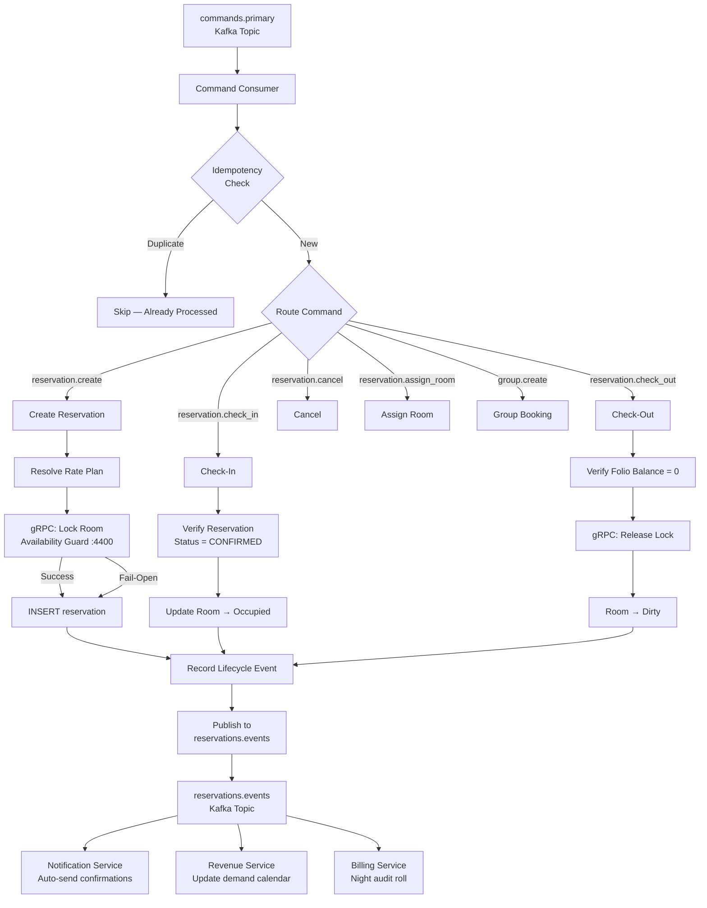

#### Kafka Commands (38)

| Category | Commands |
|----------|----------|
| **Core Lifecycle** (13) | `reservation.create`, `.modify`, `.cancel`, `.check_in`, `.check_out`, `.assign_room`, `.unassign_room`, `.extend_stay`, `.rate_override`, `.add_deposit`, `.release_deposit`, `.no_show`, `.batch_no_show` |
| **Walk-in & Expire** (3) | `reservation.walkin_checkin`, `.expire`, `.walk_guest` |
| **Mobile Check-in** (3) | `reservation.mobile_checkin.start`, `.complete`, `.generate_registration_card` |
| **Quotes** (2) | `reservation.send_quote`, `.convert_quote` |
| **Waitlist** (4) | `reservation.waitlist_add`, `.waitlist_convert`, `.waitlist_offer`, `.waitlist_expire_sweep` |
| **Group Bookings** (6) | `group.create`, `.add_rooms`, `.upload_rooming_list`, `.cutoff_enforce`, `.billing.setup`, `.check_in` |
| **OTA Integration** (5) | `integration.ota.sync_request`, `.rate_push`, `.content_sync`, `integration.webhook.retry`, `.mapping.update` |
| **Metasearch** (3) | `metasearch.config.create`, `.config.update`, `.click.record` |

#### Availability Guard Integration (gRPC)

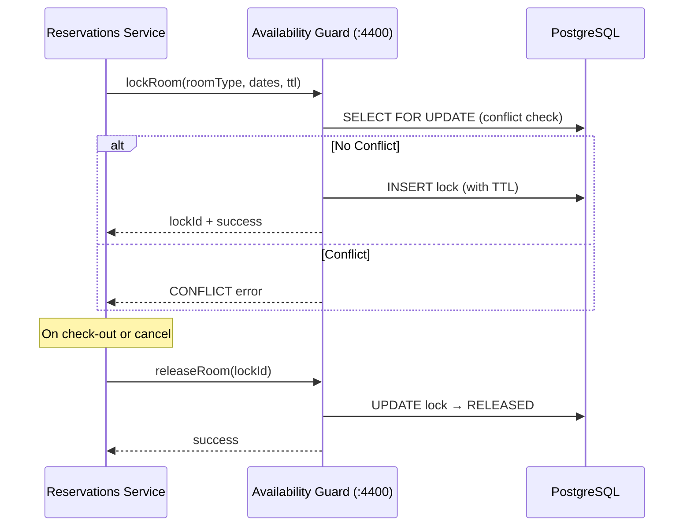

---

### 6. Billing Service (Port 3025)

**Role:** Financial engine for the PMS — handles folios, charges, payments, invoices, accounts receivable, night audit room charge posting, tax calculations, and folio routing.

**Where it stands:** Billing is triggered by reservation events (night audit posts room charges) and by direct commands (payment capture, invoice creation). It is the financial ledger of the system.

#### How It Processes a Request

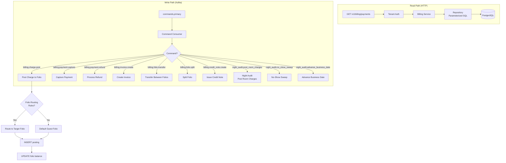

#### Kafka Commands (25+)

| Category | Commands |
|----------|----------|
| **Charges** | `billing.charge.post`, `.void` |
| **Payments** | `billing.payment.capture`, `.refund`, `.apply`, `.void` |
| **Folios** | `billing.folio.create`, `.close`, `.transfer`, `.split`, `billing.folio_window.create` |
| **Invoices** | `billing.invoice.create`, `.adjust`, `.finalize`, `.void`, `billing.credit_note.create` |
| **Cashier** | `billing.cashier.open`, `.close`, `.handover` |
| **Night Audit** | `night_audit.post_room_charges`, `.no_show_sweep`, `.advance_business_date`, `.close_fiscal_period` |
| **AR** | `billing.ar.create_account`, `.post_payment` |
| **Tax** | `billing.tax_config.update` |
| **Folio Routing** | `billing.folio_routing.create`, `.update`, `.delete` |
| **Deposits** | `billing.deposit.capture`, `.release` |

---

### 7. Housekeeping Service (Port 3030)

**Role:** Manages housekeeping operations — task assignment, room inspection, deep cleaning schedules, incident reporting, lost & found, maintenance requests, staff scheduling, and cashier sessions.

**Where it stands:** Housekeeping operates in parallel with the front-desk workflow. When a guest checks out, the room status changes to "dirty," triggering housekeeping task creation. Once cleaned and inspected, the room is marked available for the next guest.

#### How It Processes a Request

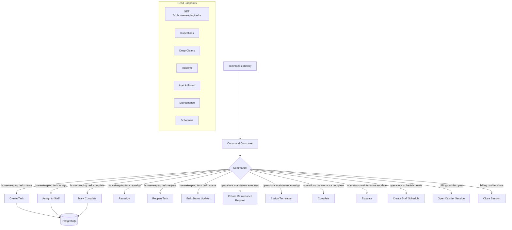

#### Kafka Commands (16)

| Command | Description |
|---------|-------------|
| `housekeeping.task.create` | Create a housekeeping task |
| `housekeeping.task.assign` | Assign task to staff member |
| `housekeeping.task.complete` | Mark task as completed |
| `housekeeping.task.reassign` | Reassign to different staff |
| `housekeeping.task.reopen` | Reopen a completed task |
| `housekeeping.task.add_note` | Add note to a task |
| `housekeeping.task.bulk_status` | Bulk update statuses |
| `operations.schedule.create` | Create staff schedule |
| `operations.schedule.update` | Update staff schedule |
| `operations.maintenance.request` | Create maintenance request |
| `operations.maintenance.assign` | Assign maintenance technician |
| `operations.maintenance.complete` | Complete maintenance |
| `operations.maintenance.escalate` | Escalate maintenance request |
| `billing.cashier.open` | Open cashier session |
| `billing.cashier.close` | Close cashier session |
| `billing.cashier.handover` | Cashier shift handover |

---

### 8. Availability Guard Service (Port 3045 / gRPC 4400)

**Role:** Distributed room inventory lock manager. Provides sub-millisecond lock acquisition and release via gRPC for the reservations pipeline. Prevents double-booking through pessimistic locking with TTL-based auto-expiry.

**Where it stands:** The Availability Guard sits between the reservations service and the database as a concurrency control layer. It uses `SELECT FOR UPDATE` with date-range overlap detection to prevent two reservations from booking the same room for the same dates.

#### How It Processes a Request

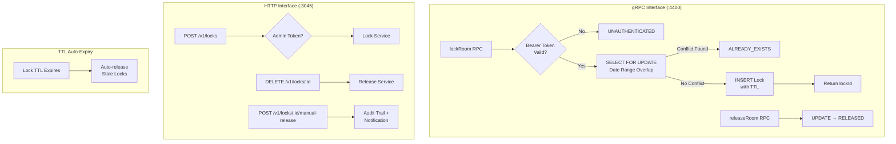

#### Key Design Decisions

| Decision | Details |
|----------|---------|
| **Pessimistic locking** | `SELECT FOR UPDATE` prevents concurrent access to same room/date range |
| **TTL-based expiry** | Locks auto-expire via `expires_at` column, capped at `maxTtlSeconds` |
| **Idempotent re-lock** | `ON CONFLICT (id) DO UPDATE` for safe retries |
| **Fail-open mode** | Reservations proceed without locks if the guard is down (shadow mode) |
| **Manual release audit** | Transactional audit record + notification dispatch for manual overrides |

---

### 9. Notification Service (Port 3055)

**Role:** Handles all outbound communications — email, SMS, in-app notifications. It is both a **Kafka command consumer** (for explicit send commands) and a **reservation event consumer** (for automatic booking confirmations, cancellation notices, etc.).

**Where it stands:** Notification Service is a downstream consumer. It never initiates writes — it reacts to events from the reservations pipeline and commands from the gateway to send templated communications to guests and staff.

#### How It Processes a Request

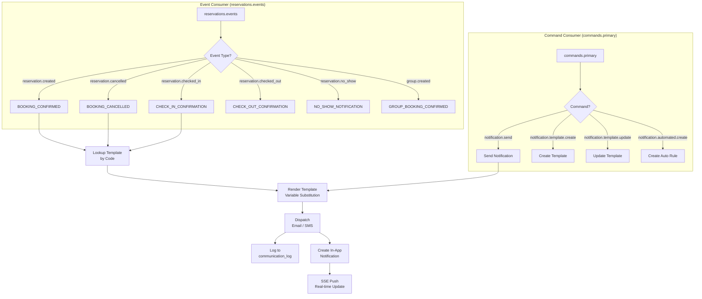

#### Event-to-Template Mapping

| Reservation Event | Template Code |
|-------------------|---------------|
| `reservation.created` | `BOOKING_CONFIRMED` |
| `reservation.cancelled` | `BOOKING_CANCELLED` |
| `reservation.checked_in` | `CHECK_IN_CONFIRMATION` |
| `reservation.checked_out` | `CHECK_OUT_CONFIRMATION` |
| `reservation.no_show` | `NO_SHOW_NOTIFICATION` |
| `reservation.modified` | `BOOKING_MODIFIED` |
| `reservation.quoted` | `QUOTE_SENT` |
| `reservation.expired` | `RESERVATION_EXPIRED` |
| `reservation.created_from_ota` | `OTA_BOOKING_CONFIRMED` |
| `group.created` | `GROUP_BOOKING_CONFIRMED` |
| `group.rooming_list_uploaded` | `GROUP_ROOMING_LIST` |
| `group.cutoff_enforced` | `GROUP_CUTOFF_NOTICE` |

#### Kafka Commands (7)

| Command | Description |
|---------|-------------|
| `notification.send` | Send a notification using a template |
| `notification.template.create` | Create communication template |
| `notification.template.update` | Update template |
| `notification.template.delete` | Delete template |
| `notification.automated.create` | Create automated message rule |
| `notification.automated.update` | Update automated rule |
| `notification.automated.delete` | Delete automated rule |

---

### 10. Revenue Service (Port 3060)

**Role:** Revenue management system — dynamic pricing, demand forecasting, competitor rate intelligence, hurdle rates, booking pace analysis, and 30+ analytical commands. This is the most analytically intensive service.

**Where it stands:** Revenue Service is both a command consumer and a reservation event consumer. It maintains a real-time demand calendar updated by reservation events and provides pricing recommendations, competitive intelligence, and revenue KPIs to the front-desk and management.

#### How It Processes a Request

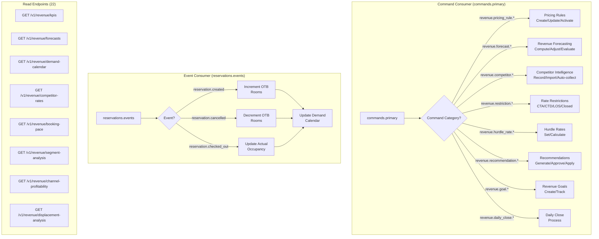

#### Kafka Commands (32)

| Category | Commands |
|----------|----------|
| **Pricing Rules** (5) | `revenue.pricing_rule.create`, `.update`, `.activate`, `.deactivate`, `.delete` |
| **Forecasting** (3) | `revenue.forecast.compute`, `.adjust`, `.evaluate` |
| **Demand** (2) | `revenue.demand.update`, `.import_events` |
| **Competitor Intel** (4) | `revenue.competitor.record`, `.bulk_import`, `.configure_compset`, `.auto_collect` |
| **Competitive Response** (1) | `revenue.competitive_response.configure` |
| **Restrictions** (3) | `revenue.restriction.set`, `.remove`, `.bulk_set` |
| **Hurdle Rates** (2) | `revenue.hurdle_rate.set`, `.calculate` |
| **Goals** (4) | `revenue.goal.create`, `.update`, `.delete`, `.track_actual` |
| **Daily Close** (1) | `revenue.daily_close.process` |
| **Booking Pace** (1) | `revenue.booking_pace.snapshot` |
| **Group Evaluation** (1) | `revenue.group.evaluate` |
| **Recommendations** (5) | `revenue.recommendation.generate`, `.approve`, `.reject`, `.apply`, `.bulk_approve` |

#### Read Endpoints (22)

| Category | Endpoints |
|----------|-----------|
| **Pricing** | pricing-rules, rate-recommendations, competitor-rates, demand-calendar, rate-restrictions, hurdle-rates, rate-shopping, competitive-response-rules |
| **Reports** | forecasts, goals, kpis, compset-indices, displacement-analysis, budget-variance, booking-pace, managers-daily-report, channel-profitability, forecast-accuracy, segment-analysis |

---

## Shared Libraries

These packages contain no domain logic — they provide infrastructure, patterns, and utilities shared across all services.

| Package | Purpose | Used By |
|---------|---------|---------|
| **@tartware/fastify-server** | Standardized Fastify server builder with Helmet, CORS, RFC 9457 error responses, Prometheus `/metrics`, Swagger/OpenAPI auto-generation | All HTTP services |
| **@tartware/config** | Environment variable loading with Zod validation, DB pool creation, retry utilities, Kafka config resolution | All services |
| **@tartware/telemetry** | OpenTelemetry SDK (traces + logs), Pino structured logging with PII auto-redaction (credit cards via Luhn, emails, passports, IBANs) | All services |
| **@tartware/tenant-auth** | Fastify plugin for JWT auth + multi-tenant context extraction. Role hierarchy enforcement (`withTenantScope()` decorator), module-based access control | All HTTP services |
| **@tartware/outbox** | Transactional outbox pattern for exactly-once Kafka publishing. `SKIP LOCKED` dequeue, tenant throttling | api-gateway, reservations-cmd |
| **@tartware/command-center-shared** | Command dispatch SQL repositories, command registry, feature flag management, command validation + outbox insertion | api-gateway |
| **@tartware/command-consumer-utils** | Kafka consumer lifecycle management, DLQ payload builder, consumer metrics, `createKafkaProducer` | All Kafka consumers |
| **@tartware/openapi-utils** | Zod-to-JSON-Schema conversion for Fastify route schemas (OpenAPI 3.x compatible) | All HTTP services |

---

## Industry Standards

Tartware implements industry-standard hospitality patterns and protocols:

| Standard | Implementation |
|----------|----------------|
| **USALI (Uniform System of Accounts for the Lodging Industry)** | Chart of accounts structure, revenue categorization, department-based P&L reporting |
| **PCI DSS Compliance** | No raw card storage, tokenized payments, PII redaction in logs (Luhn detection), parameterized queries |
| **GDPR (EU General Data Protection Regulation)** | Art. 15 (data export), Art. 16 (rectification), Art. 17 (erasure — 9-step process), Art. 18 (restriction), consent ledger, retention sweep |
| **CCPA (California Consumer Privacy Act)** | Opt-out support, privacy settings per guest |
| **RFC 9457 (Problem Details for HTTP APIs)** | Structured error responses with `type`, `title`, `status`, `detail`, `instance` on all services |
| **OpenAPI 3.0.3** | Auto-generated Swagger specs on all 10+ services |
| **W3C Trace Context** | Distributed tracing with OpenTelemetry, trace ID propagation across all services |
| **STR (Smith Travel Research) Metrics** | Competitive set indices, RevPAR, ADR, occupancy benchmarking |
| **HTNG (Hotel Technology Next Generation)** | OTA integration patterns, channel mapping, rate push, content sync |
| **Night Audit Process** | Room charge posting, no-show sweep, business date advance, fiscal period close — standard hotel end-of-day workflow |
| **Folio Management** | 5 folio types (guest, master, company, group, house), windowed folios, routing rules, split/transfer |
| **Revenue Management** | Hurdle rates, CTA/CTD/LOS restrictions, dynamic pricing, demand forecasting, competitive response rules |
| **Guest Lifecycle** | 10 reservation statuses, VIP levels (1–5), loyalty tiers, preference tracking, merge/deduplicate |
| **CQRS + Event Sourcing** | Command-Query Responsibility Segregation with Kafka event bus and transactional outbox pattern |

---

## Best Practices

### Architecture & Scalability

| Practice | Implementation |
|----------|----------------|
| **CQRS** | Reads (HTTP proxy) and writes (Kafka commands) are completely separated |
| **Transactional Outbox** | All Kafka publishes go through a DB outbox table first, ensuring exactly-once semantics with `SKIP LOCKED` dequeue |
| **Circuit Breaker** | Per-service state machine (CLOSED → OPEN → HALF_OPEN) with configurable thresholds and Prometheus metrics |
| **Idempotency** | Every command supports deduplication via idempotency keys with fail-open/fail-closed modes |
| **Dead Letter Queue** | Failed commands routed to `commands.primary.dlq` with full context for replay |
| **Tenant Isolation** | Every DB query scoped by `tenant_id`; no cross-tenant data leakage |
| **Graceful Shutdown** | SIGTERM/SIGINT handlers drain Kafka consumers, close DB pools, use `Promise.allSettled` |

### Security

| Practice | Implementation |
|----------|----------------|
| **100% Parameterized Queries** | Zero string concatenation in SQL — all queries use `$1, $2, ...` placeholders |
| **Zod Input Validation** | Every route body, query param, and command payload validated with Zod schemas |
| **JWT Authentication** | RS256 with issuer/audience validation, grace window rotation |
| **RBAC** | 5-tier role hierarchy with module-level permissions and screen-permission UI |
| **PII Redaction** | Pino logger with 40+ redaction paths; auto-detects credit cards (Luhn), emails, passports, IBANs |
| **Rate Limiting** | Redis-backed distributed rate limiting with tiered limits per endpoint type |
| **Helmet + CORS** | Helmet security headers on all services, explicit CORS allow-list |
| **MFA** | TOTP enrollment, verification, and rotation |

### Data & Database

| Practice | Implementation |
|----------|----------------|
| **Schema-First Development** | SQL and Zod schemas kept in lockstep; `schema/` is single source of truth |
| **201 Tables** | Comprehensive normalized schema with proper 3NF and intentional JSONB for flexible structure |
| **Idempotent DDL** | All migrations use `IF NOT EXISTS`, `ON CONFLICT DO NOTHING` |
| **Audit Trails** | `created_at`, `updated_at`, `created_by`, `updated_by` on all tables with soft-delete support |
| **CHECK Constraints** | Status enums, non-negative amounts, business invariants enforced at DB level |
| **Pagination** | All list endpoints paginated with `limit`/`offset` and sane caps |
| **No N+1 Queries** | JOINs/CTEs and batched `IN (...)` queries for list endpoints |

### Observability

| Practice | Implementation |
|----------|----------------|
| **Distributed Tracing** | OpenTelemetry SDK with W3C context propagation, Jaeger export |
| **Structured Logging** | Pino with JSON output, trace context injection, 40+ PII redaction paths |
| **Prometheus Metrics** | `/metrics` endpoint on all services with default Node.js metrics |
| **Health Checks** | `/health` (liveness) and `/ready` (readiness with DB + Kafka checks) on all services |

### Code Quality

| Practice | Implementation |
|----------|----------------|
| **Biome** | Fast linter + formatter across all packages |
| **Knip** | Dead code / unused export detection |
| **ESLint** | TypeScript-aware linting with strict rules |
| **Vitest** | 72 test files across services |
| **Per-Service CI** | Individual GitHub Actions workflows per service |

---

## Quick Start

```bash
# Install dependencies
pnpm install

# Start infrastructure
docker compose up -d postgres redis kafka

# Bootstrap Kafka topics
pnpm run kafka:topics

# Start all services
pnpm run dev
```

## Dev Ports

| Port | Service | Protocol |
|------|---------|----------|
| 8080 | API Gateway | HTTP |
| 3000 | Core Service | HTTP |
| 3005 | Settings Service | HTTP |
| 3010 | Guests Service | HTTP |
| 3015 | Rooms Service | HTTP |
| 3020 | Reservations Command Service | HTTP + Kafka |
| 3025 | Billing Service | HTTP + Kafka |
| 3030 | Housekeeping Service | HTTP + Kafka |
| 3035 | Command Center Service | Kafka |
| 3040 | Recommendation Service | HTTP |
| 3045 | Availability Guard Service | HTTP + gRPC (4400) |
| 3050 | Roll Service | Kafka (internal) |
| 3055 | Notification Service | HTTP + Kafka |
| 3060 | Revenue Service | HTTP + Kafka |
| 3065 | Guest Experience Service | Kafka |
| 3070 | Calculation Service | HTTP |
| 3075 | Service Registry | HTTP |

## License

UNLICENSED — Proprietary
